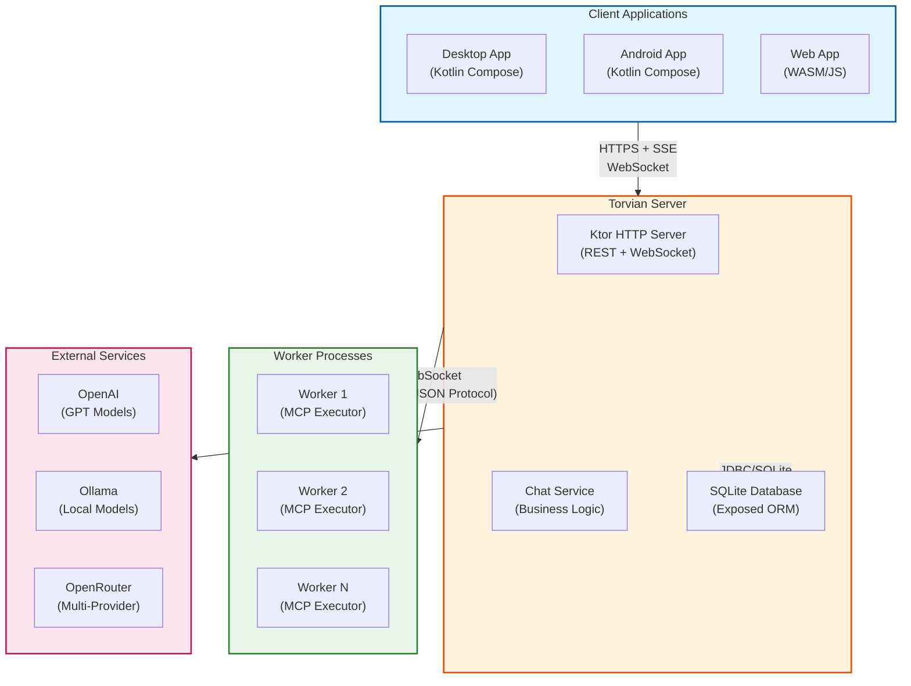

# Torvian Chatbot

## Why Torvian Chatbot
Torvian Chatbot is a self-hosted AI workspace for users who want control over data, model providers, and tool execution. You run the server, bring your own LLM setup, and keep humans in the loop for agentic actions.

### Key Features
- 🧠 Bring your own LLM providers: OpenAI-compatible APIs and local Ollama models.
- 📡 Stream model responses in real time, with support for concurrent responses from different chat sessions.
- 🧵 Organize long conversations with threaded/branched message flows.
- 🛡️ Keep control of tool execution: tool calls require approval by default, with optional per-tool auto-approve or auto-deny preferences.
- 🔁 Easily restart agentic conversations from any previous message, with full context and tool state restoration.
- 👥🔐 Manage multi-user access with authentication plus role/permission-based authorization.
- 💻📱🌐 Multi-platform clients for desktop, web, and Android, all connecting to the same server.
- ⚙️⏰ Run tools 24/7 on any machine (local, remote, VM), independent from where the client apps are running.

## Platform Architecture
- **Server**: Core API and orchestration layer for authentication/authorization, chat sessions, message processing, LLM integration, tool lifecycle, and persistence.
- **Client apps**: Compose Multiplatform UI for Desktop, Web (WASM), and Android to chat, configure providers/models, and manage tools.
- **Worker (optional)**: Standalone process for tool execution, useful for workspace isolation and always-on availability.

## System Architecture

For a detailed explanation of the system architecture, including the LLM chat loop, remote tool execution flows, worker registration, and security context, see the [System Architecture Flows](docs/onboarding/Torvian%20Chatbot%20System%20Architecture%20Flows.md) document.

### High-Level Architecture



## Project Status
This project is in active development.

- **Server + Desktop**: Most complete and stable combination for daily use.
- **Web (WASM)**: Stable with some limitations
- **Android**: Early-stage usability with known UX limitations.

## Getting Started

### Use pre-built packages
Pre-built packages are available from the [Releases page](https://github.com/Torvian-eu/chatbot/releases):
- **Server**: Available for all platforms. Use Docker (recommended) or JDK 21+ to run it locally.
- **Desktop Client**: Available for Windows and Linux.
- **Web Client**: Available as a static web app. It must be served over HTTP(S).

### Run the server (required)
```bash
# Linux/Mac
<install-path>/start-server.sh
# Windows
<install-path>/start-server.bat
```

**Docker quick start:**

```bash
docker run -d \
  --name chatbot-server \
  -p 8080:8080 \
  -v chatbot-config:/app/config \
  -v chatbot-data:/app/data \
  -v chatbot-logs:/app/logs \
  -e SERVER_HOST=0.0.0.0 \
  -e SERVER_CONNECTOR_TYPE=HTTP \
  --restart unless-stopped \
  ghcr.io/torvian-eu/chatbot-server:latest
```

For full deployment options and configuration details (including Docker Compose + Caddy), see [deploy/README.md](deploy/README.md).

### Run the desktop application (recommended)
```bash
# Windows
<install-path>/Chatbot-with-logs.bat
# Linux/Mac (if building from source, see below)
<install-path>/Chatbot-with-logs.sh
```

### Serve the web client (optional, not recommended)
The web client is a static web application and must be served over HTTP(S). Opening `index.html` directly via `file://` will not work, because browsers block loading WASM and related assets from local files.

For local testing, you can use any simple static file server.

**Example using Python:**
```bash
cd <web-client-dist-path>
python -m http.server 4000
```

Then open your browser and navigate to:
```text
http://localhost:4000
```

Notes:
- For production or VPS deployments, serve the same files using a regular web server such as Caddy or nginx.
- The address of the web client will need to be added to the CORS allowed origins in the server configuration to allow the web client to connect.

### Run the worker (required for MCP tool execution)
```bash
# Linux/Mac
<install-path>/start-worker.sh
# Windows
<install-path>/start-worker.bat
```

Notes: 
- The server must be running before starting the worker.
- An **active** user (or admin) account is required to start the worker, because the worker needs to authenticate with the server.
- On first startup, the worker will prompt you to enter the server URL and user credentials to connect. An SSL certificate will be generated during setup. On subsequent startups, the stored SSL certificate (and private key) will be used for authentication.

### Login
Login with username `admin` and password `admin123`. You will be asked to change the password on first login.

## Build from Source

### Prerequisites
- [Git](https://git-scm.com/install/)
- [JDK 21](https://adoptium.net/installation) or higher
- Gradle 9.x (included via wrapper)

### Clone the repository
```bash
cd <parent-path>
git clone https://github.com/Torvian-eu/chatbot.git
```

### Build & Install Server application
```bash
./gradlew server:installDist
```
The files will be installed to `server/build/install/server/`. You can run the server using the scripts in that folder.

### Build & Install Desktop application
```bash
./gradlew app:createDistributable
```
The files will be installed to `app/build/compose/binaries/main/app/Chatbot`. You can run the desktop client using the scripts in that folder.

### Build & Install Web application
```bash
./gradlew app:wasmJsBrowserDistribution
```
The files will be installed to `app/build/dist/wasmJs/productionExecutable`. You can serve the web client using any static file server, as described in the "Serve the web client" section above.

## Guides
These guides provide information on how to configure and use specific features of the chatbot.
- [LLM configuration guide](docs/user%20guides/LLM%20configuration%20guide.md) - How to configure LLM providers, models and model settings. And how to use them in the chatbot.
- [MCP server configuration guide](docs/user%20guides/MCP%20server%20configuration%20guide.md) - How to configure and use MCP servers.

## Deployment
For information on deploying the chatbot application to a VPS or server environment, please refer to the [Deployment Guide](deploy/README.md). This includes:
- Quick Docker server startup
- Docker setup with Caddy reverse proxy
- VPS deployment with Docker Compose
- Configuration via environment variables

Additional deployment-related documentation:
- [VPS Deployment Guide](docs/VPS/Docker%20VPS%20Deployment%20Guide.md) - Comprehensive guide for VPS deployment
- [VPS Basics Guide](docs/VPS/Ubuntu%20VPS%20Basics%20Guide%20for%20Self-Hosted%20Docker%20Apps.md) - Linux basics for VPS management
- [Docker Installation Guide](docs/VPS/Docker%20Installation%20guide.md) - How to install Docker on a VPS

## Project Structure
```
chatbot/
├── server/                 # Server module
├── worker/                 # Worker module for MCP tool execution
├── app/                    # Client application module (Desktop, Web, Android)
├── common/                 # Shared code
├── build-logic/            # Gradle convention plugins
├── docs/                   # Documentation
└── gradle/                 # Gradle wrapper and dependencies
```

## Tech Stack
- **Languages**: Kotlin 2.3.10
- **UI Framework**: Compose Multiplatform 1.10.2 (with Material 3 1.9.0)
- **Server**: Ktor 3.4.1
- **Database**: SQLite with Exposed ORM 1.1.1 (Server) and SQLDelight 2.2.1 (App)
- **Dependency Injection**: Koin 4.1.1
- **Functional Programming**: Arrow 2.2.2
- **Logic**: kotlinx.serialization
- **Build Tool**: Gradle 9.4.0

## Additional Documentation
- [Project Directory Tree](docs/project-directory-tree.md)
- [Known Issues](docs/Known%20bugs.md)
- [TODO List](docs/Todos.md)
- [New feature ideas](docs/New%20feature%20ideas.md)

## License
This project is licensed under the [MIT License](LICENSE)

## Contributing
We welcome community contributions to the Torvian Chatbot! Your feedback, bug reports, feature suggestions, and code contributions are highly valued.

Please see our comprehensive [Contributing Guide](CONTRIBUTING.md) for detailed information on how to get involved.

## Support
For support or general questions, please post a message in the [GitHub discussion forum](https://github.com/Torvian-eu/chatbot/discussions).

## Screenshots
- Desktop app GUI: 
- MCP server configuration: 

