# Architectural Definition: V1.1
Okay PM, team, let's define the architectural boundaries and key service interfaces for V1.1 of the AIChat Desktop App. This version incorporates **message threading** and **chat session grouping**. This definition is crucial for ensuring E7.S5 ("Implement Layered Architecture") is addressed and helps both the backend and frontend developers understand where their code lives and how different parts of the system should interact, specifically around managing conversations and their organization.

Based on our requirements and the chosen tech stack (Kotlin, Compose for Desktop, Ktor Client, Exposed for SQLite), we will follow a standard **Layered Architecture** pattern, distributed across three dedicated Gradle modules: `common`, `server`, and `app`.

The V1.1 architecture flow is: Compose Frontend (in `app` module) talks to a Ktor Client (in `app` module), which then communicates via HTTP to an Embedded Ktor Server (in `server` module) running within the same desktop application process. This server exposes the core Backend Service Layer (in `server` module), which in turn interacts with the Data Access and External Services Layers (both in `server` module). All shared data models (DTOs) will reside in the `common` module.

This clarifies that the UI talks to an _HTTP client_, which talks to the _server_. The backend _services_ are behind the server's HTTP endpoints.

## 1. Core Layers and Responsibilities
### `common` Gradle Module:
*   **Common Data Models Layer (`eu.torvian.chatbot.common.models/`):**
    *   **Responsibility:** Holds fundamental data structures (DTOs) that are shared across the `app` (frontend) and `server` (backend) modules, primarily for API communication. **Includes data models for chat sessions, messages (with threading relationships), LLM models, model settings, and chat groups.**
    *   **Interaction:** No internal dependencies. Serves as a dependency for both `app` and `server` modules.

### `app` Gradle Module:
*   **UI Layer (`eu.torvian.chatbot.app.ui/`):**
    *   **Responsibility:** Renders the user interface using Compose for Desktop, handles user input events, manages UI-specific state (`ChatState`, `SessionListState`). This includes rendering messages by displaying only a single branch of the conversation tree at a time and managing the state of the currently viewed branch, and **rendering the session list organized by groups**. It handles user interactions, specifically for replying to a message, switching between branches, **managing groups, and assigning sessions to groups (including drag-and-drop)**. It knows nothing about HTTP, Services, DAOs, or the database schema.
    *   **Interaction:** Calls methods on the **Frontend API Client Interfaces** (`ChatApi`, **`GroupApi`**) (within the same `app` module) to perform actions or retrieve data. It knows nothing about HTTP, Services, DAOs, or the database schema.

*   **Frontend API Client Layer (`eu.torvian.chatbot.app.api.client/`):**
    *   **Responsibility:** Provides interfaces (`ChatApi`, **`GroupApi`**) that the UI's state holders use, and contains the implementations (`KtorChatApiClient`, **`KtorGroupApiClient`**) that translate interface method calls into HTTP requests targeting the embedded Ktor server. **This layer handles API calls related to sending messages (including replies), managing sessions, managing LLM models/settings, and managing chat groups.**
    *   **Interaction:** Depends on a Ktor `HttpClient` instance configured to talk to `localhost`. Calls the Embedded Ktor Server (located in the `server` module).

### `server` Gradle Module:
*   **Embedded Ktor Server Layer (`eu.torvian.chatbot.server.api.server/`):**
    *   **Responsibility:** Receives incoming HTTP requests from the Frontend API Client, parses request bodies (**including data for sending messages, updating sessions, and managing groups**), authenticates/authorizes (minimal for desktop), calls the appropriate backend **Service Layer** method, and formats the response into HTTP/JSON.
    *   **Interaction:** Depends on and calls the **Application/Service Layer Interfaces** (within the same `server` module). Knows about HTTP requests/responses, JSON serialization/deserialization, and routing. Contains minimal business logic.

*   **Application/Service Layer (Backend Core - `eu.torvian.chatbot.server.service/`):**
    *   **Responsibility:** Contains the core business logic. Orchestrates operations like sending messages (**handling threaded replies**, which involves fetching context that respects threads, calling the LLM, and saving results while _maintaining thread relationships_), managing sessions (**including assignment to groups**), configuring models/settings, and **managing chat groups (CRUD, handling session reassignment on deletion)**. **This layer is responsible for implementing the logic to create, manage, and retrieve messages while preserving their parent-child relationships and managing session-to-group assignments.**
    *   **Interaction:** Called by the **Embedded Ktor Server Layer**. Depends on and calls the **Data Access Layer Interfaces** and **External Services Layer Interfaces** (all within the same `server` module). It knows _what_ needs to be done but not _how_ data is stored or external systems are called.

*   **Data Access Layer (DAL - `eu.torvian.chatbot.server.data.dao/` & `eu.torvian.chatbot.server.data.exposed/`):**
    *   **Responsibility:** Interacts directly with the persistent storage (SQLite using Exposed). Provides methods for CRUD (Create, Read, Update, Delete) operations on the application's data entities (Sessions, Messages, Models, Settings, **Groups**). It knows about the database schema (Exposed Tables). **This layer is responsible for persisting and retrieving application data including sessions (with groupId), messages (including** `parentMessageId` **and** `childrenMessageIds`**), LLM models, model settings, and chat groups. It provides methods for updating message thread relationships and managing session-to-group assignments.**
    *   **Interaction:** Called by the **Application/Service Layer Implementations**. Depends on the Exposed Table definitions (`eu.torvian.chatbot.server.data.models/`).

*   **External Services Layer (`eu.torvian.chatbot.server.external/`):**
    *   **Responsibility:** Encapsulates interactions with anything outside the main application logic: the LLM APIs (via Ktor Client) and the OS Credential Manager.
    *   **Interaction:** Called by the **Application/Service Layer Implementations**. The LLM interaction logic within this layer accepts context built by the Service Layer that reflects message threading.

## 2. Revised Project and Package Structure
The project consists of three top-level Gradle modules: `common`, `server`, and `app`. The structure supports the defined layers and entities for V1.1.

```
<project_root>/
├── build.gradle.kts      <- Root project build file
├── settings.gradle.kts   <- Defines modules: include("common", "server", "app")
├── common/               <- Gradle Module: Shared Data Models
│   └── src/main/kotlin/eu/torvian/chatbot/common/
│       └── models/        <- Common Data Models (DTOs), including threading and grouping fields
│           ├── ChatSession.kt
│           ├── ChatMessage.kt
│           ├── LLMModel.kt
│           └── ModelSettings.kt
│           └── ChatGroup.kt   <- Model for groups
│           └── ... summaries, request/response DTOs for API, etc. ...
│
├── server/               <- Gradle Module: Backend Logic (Embedded Ktor Server, Services, Data, External)
│   └── src/main/kotlin/eu/torvian/chatbot/server/
│       ├── api/server/    <- Embedded Ktor Server Layer
│       │   ├── ApiRoutes.kt <- Defines Ktor routing handlers (Calls eu.torvian.chatbot.server.service interfaces)
│       │   └── Serialization.kt <- Ktor JSON setup
│       │   └── ... other server setup ...
│       ├── service/       <- Application/Service Layer - Implementations handle threading and grouping logic
│       │   ├── ChatService.kt   <- Interface (Consumed by api/server/ApiRoutes)
│       │   ├── ChatServiceImpl.kt <- Implementation (Calls data/dao and external, handles threading and session assignment)
│       │   ├── ModelService.kt  <- Interface (Consumed by api/server/ApiRoutes)
│       │   ├── ModelServiceImpl.kt <- Implementation (Calls data/dao and external)
│       │   ├── GroupService.kt  <- Interface (Consumed by api/server/ApiRoutes)
│       │   └── GroupServiceImpl.kt <- Implementation (Calls data/dao, handles group CRUD and session ungrouping)
│       │   └── ... other service interfaces/impls ...
│       ├── data/          <- Data Access Layer (DAL) - Implementations persist/retrieve threading and grouping info
│       │   ├── dao/         <- Data Access Object interfaces (Consumed by service impls)
│       │   │   ├── SessionDao.kt
│       │   │   ├── MessageDao.kt
│       │   │   ├── ModelDao.kt
│       │   │   └── SettingsDao.kt
│       │   │   └── GroupDao.kt   <- DAO interface for groups
│       │   ├── exposed/      <- Exposed implementation of DAOs
│       │   │   ├── Database.kt  <- Exposed connection/setup (E7.S4)
│       │   │   ├── SessionDaoExposed.kt
│       │   │   ├── MessageDaoExposed.kt
│       │   │   ├── ModelDaoExposed.kt
│       │   │   └── SettingsDaoExposed.kt
│       │   │   └── GroupDaoExposed.kt   <- Exposed implementation for Group DAO
│       │   └── models/      <- Database Schema Definitions (Exposed Tables) - Schema supports threading and grouping fields
│       │       ├── ChatSessions.kt    <- Exposed Table object (includes groupId FK)
│       │       ├── ChatMessages.kt <-- Exposed Table object (includes parent/children columns)
│       │       ├── LLMModels.kt
│       │       └── ModelSettings.kt
│       │       └── ChatGroups.kt    <- Exposed Table object for groups
│       └── external/      <- External Services Layer
│           ├── llm/         <- LLM Interaction (Ktor Client) - LLMClient accepts thread context
│           │   ├── LLMApiClient.kt <- Interface (Consumed by service impls)
│           │   └── LLMApiClientKtor.kt <- Implementation (uses Ktor Client)
│           ├── security/    <- Credential Management
│           │   ├── CredentialManager.kt <- Interface (E5.S1)
│           │   └── windows/     <- OS-specific implementations
│           │       └── WinCredentialManager.kt <- Windows Impl (E5.S1 details)
│           └── models/      <- DTOs for external APIs (OpenAI, etc.)
│               └── OpenAiApiModels.kt <- Data classes for Ktor serialization
│
└── app/                  <- Gradle Module: Desktop Application (UI, Frontend API Client)
    └── src/main/kotlin/eu/torvian.chatbot.app/
        ├── App.kt        <- Application entry point, setup (Ktor Server start, UI launch, DI)
            ├── ui/            <- UI Layer (Compose for Desktop) - Renders threads and grouped sessions
            │   ├── AppLayout.kt
            │   ├── ChatArea.kt
            │   ├── SessionListPanel.kt
            │   ├── InputArea.kt
            │   ├── SettingsScreen.kt
            │   ├── ... other UI components ...
            │   └── state/           <- UI State Management (e.g., ChatState, SessionListState ViewModel) - Handles threaded and grouped data for display
            │       ├── ChatState.kt <- Depends on eu.torvian.chatbot.app.api.client.ChatApi
            │       └── SessionListState.kt <- Depends on eu.torvian.chatbot.app.api.client.ChatApi, eu.torvian.chatbot.app.api.client.GroupApi
            └── api/
                └── client/        <- Frontend API Client Layer - Translates UI actions to API calls for chat, models, settings, and groups
                    ├── ChatApi.kt <- Interface (Consumed by eu.torvian.chatbot.app.ui.state.ChatState/SessionListState)
                    ├── GroupApi.kt <- Interface (Consumed by eu.torvian.chatbot.app.ui.state.SessionListState or similar)
                    ├── KtorChatApiClient.kt <- Implementation (Uses Ktor Client to talk to localhost)
                    └── KtorGroupApiClient.kt <- Implementation (Uses Ktor Client to talk to localhost)
```

## 3. Key Interface Definitions (Module-Specific & ID Types)
These interfaces define the contracts between layers.

*   **Common Data Models (in `common` module):**

```kotlin
// common/src/main/kotlin/eu/torvian/chatbot/common/models/ChatSession.kt
package eu.torvian.chatbot.common.models
import kotlinx.datetime.Instant
import kotlinx.serialization.Serializable

/**
 * Represents a single chat session or conversation.
 * Used as a shared data model between frontend and backend.
 *
 * @property id Unique identifier for the session (Database PK).
 * @property name The name or title of the session.
 * @property createdAt Timestamp when the session was created.
 * @property updatedAt Timestamp when the session was last updated (e.g., message added).
 * @property groupId Optional ID referencing a parent group (null if ungrouped).
 * @property currentModelId Optional ID of the currently selected LLM model for this session.
 * @property currentSettingsId Optional ID of the currently selected settings profile for this session.
 * @property currentLeafMessageId The current leaf message in the session, used for displaying the correct branch in the UI (null only when no messages exist).
 * @property messages List of messages within this session (included when loading full details).
 */
@Serializable
data class ChatSession(
    val id: Long,
    val name: String,
    val createdAt: Instant,
    val updatedAt: Instant,
    val groupId: Long?, // Reference to ChatGroup.id
    val currentModelId: Long?,
    val currentSettingsId: Long?,
    val currentLeafMessageId: Long?,
    val messages: List<ChatMessage> = emptyList()
)
```

```kotlin
// common/src/main/kotlin/eu/torvian.chatbot.common/models/ChatSessionSummary.kt
package eu.torvian.chatbot.common.models
import kotlinx.datetime.Instant
import kotlinx.serialization.Serializable

/**
 * Represents a summary of a chat session, typically used for listing sessions
 * without loading all message details.
 * Used as a shared data model between frontend and backend.
 *
 * @property id Unique identifier for the session (Database PK).
 * @property name The name or title of the session.
 * @property createdAt Timestamp when the session was created.
 * @property updatedAt Timestamp when the session was last updated.
 * @property groupId Optional ID referencing a parent group session (null if ungrouped).
 * @property groupName Optional name of the group (null if ungrouped), included for convenience in lists.
 */
@Serializable
data class ChatSessionSummary(
    val id: Long,
    val name: String,
    val createdAt: Instant,
    val updatedAt: Instant,
    val groupId: Long?, // Reference to ChatGroup.id
    val groupName: String? = null // Name of the referenced group
)
```

```kotlin
// common/src/main/kotlin/eu/torvian.chatbot.common/models/ChatMessage.kt
package eu.torvian.chatbot.common.models
import kotlinx.datetime.Instant
import kotlinx.serialization.Serializable

/**
 *   Represents a single message within a chat session.
 *
 *   Supports both user and assistant messages and includes threading information.
 *
 *   Used as a shared data model between frontend and backend.
 *
 *   @property id Unique identifier for the message (Database PK).
 *   @property sessionId ID of the session this message belongs to (Database FK).
 *   @property role The role of the message sender (e.g., "user", "assistant").
 *   @property content The content of the message.
 *   @property createdAt Timestamp when the message was created.
 *   @property updatedAt Timestamp when the message was last updated (e.g., edited).
 *   @property parentMessageId Optional ID of the parent message. Null for root messages of threads.
 *   @property childrenMessageIds List of child message IDs. Empty for leaf messages.
 *
 */
@Serializable
sealed class ChatMessage {
    abstract val id: Long
    abstract val sessionId: Long
    abstract val role: Role
    abstract val content: String
    abstract val createdAt: Instant
    abstract val updatedAt: Instant
    abstract val parentMessageId: Long?
    abstract val childrenMessageIds: List<Long> // Stored in DB, managed by Service/DAO

    /**
     * Represents a message sent by the user.
     */
    @Serializable
    data class UserMessage(
        override val id: Long,
        override val sessionId: Long,
        override val content: String,
        override val createdAt: Instant,
        override val updatedAt: Instant,
        override val parentMessageId: Long?,
        override val childrenMessageIds: List<Long> = emptyList()
    ) : ChatMessage() {
        override val role: Role = Role.USER
    }

    /**
     * Represents a message sent by the assistant (LLM).
     * Includes details about the model and settings used.
     */
    @Serializable
    data class AssistantMessage(
        override val id: Long,
        override val sessionId: Long,
        override val content: String,
        override val createdAt: Instant,
        override val updatedAt: Instant,
        override val parentMessageId: Long?,
        override val childrenMessageIds: List<Long> = emptyList(),
        val modelId: Long?,
        val settingsId: Long?
    ) : ChatMessage() {
        override val role: Role = Role.ASSISTANT
    }

    enum class Role {
        USER, ASSISTANT
    }
}
```

```kotlin
// common/src/main/kotlin/eu/torvian.chatbot.common/models/LLMModel.kt
package eu.torvian.chatbot.common.models

data class LLMModel(
    val id: Long,
    val name: String,
    val baseUrl: String,
    val apiKeyId: String?, // Nullable, references secure storage
    val type: String // e.g., "openai", "openrouter", "custom"
)
```

```kotlin
// common/src/main/kotlin/eu/torvian.chatbot.common/models/ModelSettings.kt
package eu.torvian.chatbot.common.models

data class ModelSettings(
    val id: Long,
    val modelId: Long, // Foreign key to LLMModel.id
    val name: String, // e.g., "Default", "Creative", "Strict"
    val systemMessage: String? = null,
    val temperature: Float? = null,
    val maxTokens: Int? = null,
    val customParamsJson: String? = null // Arbitrary JSON for extra params
)
```

```kotlin
// common/src/main/kotlin/eu/torvian.chatbot.common/models/ChatGroup.kt
package eu.torvian.chatbot.common.models
import kotlinx.datetime.Instant
import kotlinx.serialization.Serializable

/**
 * Represents a user-defined group for organizing chat sessions.
 * Used as a shared data model between frontend and backend.
 *
 * @property id Unique identifier for the group (Database PK).
 * @property name The name of the group.
 * @property createdAt Timestamp when the group was created.
 */
@Serializable
data class ChatGroup(
    val id: Long,
    val name: String,
    val createdAt: Instant // Assuming we track creation time
)
```

*   **Interfaces between UI State and Frontend API Client (in `app` module):**

```kotlin
// app/src/main/kotlin/eu/torvian.chatbot.app.api.client/ChatApi.kt (Interface consumed by eu.torvian.chatbot.app.ui.state.ChatState/SessionListState)
// This interface represents the API endpoints for Chat Sessions and Messages from the frontend's perspective.
import eu.torvian.chatbot.common.models.*

interface ChatApi {
    // --- Sessions ---
    suspend fun getSessions(): List<ChatSessionSummary>
    suspend fun createSession(name: String?): ChatSession // Name is optional, backend can generate default
    suspend fun getSession(id: Long): ChatSession // Returns session with ALL messages for threading.
    suspend fun updateSession(session: ChatSession): ChatSession
    suspend fun deleteSession(id: Long)
    suspend fun assignSessionToGroup(id: Long, groupId: Long?): ChatSessionSummary // Assign session to a group (or null for ungrouped)

    // --- Messages ---
    // sendMessage supports specifying a parent message ID for threaded replies.
    // Backend API design returns [userMsg, assistantMsg] for POST
    suspend fun sendMessage(sessionId: Long, content: String, parentMessageId: Long? = null): List<ChatMessage> // Includes optional parent ID
    suspend fun updateMessage(id: Long, content: String): ChatMessage
    suspend fun deleteMessage(id: Long) // Backend defines thread deletion strategy

    // --- Models & Settings ---
    suspend fun getModels(): List<LLMModel> // List with basic model info
    suspend fun addModel(name: String, baseUrl: String, type: String, apiKey: String?): LLMModel // API key input happens here
    suspend fun updateModel(model: LLMModel): LLMModel
    suspend fun deleteModel(id: Long)
    suspend fun getSettings(id: Long): ModelSettings
    suspend fun getAllSettings(): List<ModelSettings> // Utility method if needed
    suspend fun addSettings(modelId: Long, name: String, systemMessage: String?, temperature: Float?, maxTokens: Int?, customParamsJson: String?): ModelSettings
    suspend fun updateSettings(settings: ModelSettings): ModelSettings
    suspend fun deleteSettings(id: Long)
    suspend fun isApiKeyConfiguredForModel(modelId: Long): Boolean // Check API key status
}
```

```kotlin
// app/src/main/kotlin/eu/torvian.chatbot.app.api.client/GroupApi.kt (Interface consumed by eu.torvian.chatbot.app.ui.state.SessionListState or similar)
// This interface represents the API endpoints for Group management from the frontend's perspective.
import eu.torvian.chatbot.common.models.*

interface GroupApi {
    suspend fun getGroups(): List<ChatGroup>
    suspend fun createGroup(name: String): ChatGroup
    suspend fun renameGroup(id: Long, newName: String): ChatGroup
    suspend fun deleteGroup(id: Long) // Backend handles session ungrouping
}
```

*   **Interfaces between Embedded Ktor Server and Application/Service Layer (in `server` module):**

```kotlin
// server/src/main/kotlin/eu/torvian.chatbot.server.service/ChatService.kt (Interface consumed by eu.torvian.chatbot.server.api.server.ApiRoutes)
// This service interface defines the business logic operations for Sessions and Messages independent of HTTP.
import eu.torvian.chatbot.common.models.*

interface ChatService {
    // --- Sessions ---
    fun getAllSessionsSummaries(): List<ChatSessionSummary> // Returns summaries including group names
    fun createSession(name: String?): ChatSession
    fun getSessionDetails(id: Long): ChatSession? // Returns session with ALL messages
    fun updateSessionDetails(session: ChatSession): ChatSession
    fun deleteSession(id: Long)
    fun assignSessionToGroup(id: Long, groupId: Long?): ChatSessionSummary // Assign session to a group (or null)

    // --- Messages ---
    // Core business logic for sending messages, including replies. It orchestrates DAL and External calls.
    suspend fun processNewMessage(sessionId: Long, content: String, parentMessageId: Long? = null): List<ChatMessage> // Returns [userMsg, assistantMsg]
    fun updateMessageContent(id: Long, content: String): ChatMessage
    fun deleteMessage(id: Long) // Implements chosen deletion strategy

    // --- Models & Settings related queries used internally ---
    // These might also be on ModelService, depending on desired encapsulation
    fun getModelById(id: Long): LLMModel?
    fun getSettingsById(id: Long): ModelSettings?
    fun isApiKeyConfiguredForModel(modelId: Long): Boolean
}
```

```kotlin
// server/src/main/kotlin/eu/torvian.chatbot.server.service/ModelService.kt (Interface consumed by eu.torvian.chatbot.server.api.server.ApiRoutes)
// This service interface defines the business logic for Models and Settings.
import eu.torvian.chatbot.common.models.*

interface ModelService {
    // --- Models ---
    fun getAllModels(): List<LLMModel>
    fun addModel(name: String, baseUrl: String, type: String, apiKey: String?): LLMModel // Handles key storage internally
    fun updateModel(model: LLMModel): LLMModel // Handles key update internally
    fun deleteModel(id: Long) // Handles key deletion internally, ON DELETE CASCADE for settings

    // --- Settings ---
    fun getSettingsById(id: Long): ModelSettings?
    fun getAllSettings(): List<ModelSettings> // Utility method
    fun getSettingsByModelId(modelId: Long): List<ModelSettings> // Needed internally/potentially exposed
    fun addSettings(modelId: Long, name: String, systemMessage: String?, temperature: Float?, maxTokens: Int?, customParamsJson: String?): ModelSettings
    fun updateSettings(settings: ModelSettings): ModelSettings
    fun deleteSettings(id: Long)
}
```

```kotlin
// server/src/main/kotlin/eu/torvian.chatbot.server.service/GroupService.kt (Interface consumed by eu.torvian.chatbot.server.api.server.ApiRoutes)
// This service interface defines the business logic operations for Group management.
import eu.torvian.chatbot.common.models.*

interface GroupService {
    fun getAllGroups(): List<ChatGroup>
    fun createGroup(name: String): ChatGroup
    fun renameGroup(id: Long, newName: String): ChatGroup
    fun deleteGroup(id: Long) // Handles ungrouping sessions
}
```

*   **Interfaces between Application/Service Layer and Data Access Layer (DAOs) (in `server` module):**

```kotlin
// server/src/main/kotlin/eu/torvian.chatbot.server.data.dao/SessionDao.kt
import eu.torvian.chatbot.common.models.ChatSession
import eu.torvian.chatbot.common.models.ChatSessionSummary

interface SessionDao {
    // Retrieves all sessions, including looking up group names for summaries.
    fun getAllSessions(): List<ChatSessionSummary>
    fun getSessionById(id: Long): ChatSession? // Includes all messages for threading
    fun insertSession(name: String, groupId: Long? = null): ChatSession
    fun updateSession(session: ChatSession): ChatSession // Allows updating groupId
    fun deleteSession(id: Long) // ON DELETE CASCADE for messages
    // Needed for ungrouping sessions when a group is deleted (used by GroupService)
    fun ungroupSessions(groupId: Long)
}
```

```kotlin
// server/src/main/kotlin/eu/torvian.chatbot.server.data.dao/MessageDao.kt
import eu.torvian.chatbot.common.models.ChatMessage

interface MessageDao {
    // Retrieves all messages for a session. Service layer constructs threads from this flat list.
    fun getMessagesBySessionId(sessionId: Long): List<ChatMessage>
    // Inserts a new message, saving the parent ID if provided.
    fun insertMessage(sessionId: Long, role: String, content: String, parentMessageId: Long?, modelId: Long?, settingsId: Long?): ChatMessage
    // Updates the content/timestamps of a message.
    fun updateMessage(message: ChatMessage): ChatMessage
    // Deletes a message. Implementation manages thread links (e.g., removes from parent's children list, handles children).
    fun deleteMessage(id: Long)
    // Adds a child message ID to the childrenMessageIds list of the parent message.
    fun addChildToMessage(parentId: Long, childId: Long)
    // Removes a child message ID from the childrenMessageIds list of the parent message (used during deletion of a child).
    fun removeChildFromMessage(parentId: Long, childId: Long)
}
```

```kotlin
// server/src/main/kotlin/eu/torvian.chatbot.server.data.dao/ModelDao.kt
import eu.torvian.chatbot.common.models.LLMModel

interface ModelDao {
    fun getAllModels(): List<LLMModel>
    fun getModelById(id: Long): LLMModel?
    fun getModelByApiKeyId(apiKeyId: String): LLMModel? // Note: apiKeyId is String reference
    fun insertModel(name: String, baseUrl: String, type: String, apiKeyId: String?): LLMModel
    fun updateModel(model: LLMModel)
    fun deleteModel(id: Long) // ON DELETE CASCADE should handle settings
}
```

```kotlin
// server/src/main/kotlin/eu.torvian.chatbot.server.data.dao/SettingsDao.kt
import eu.torvian.chatbot.common.models.ModelSettings

interface SettingsDao {
    fun getSettingsById(id: Long): ModelSettings?
    fun getSettingsByModelId(modelId: Long): List<ModelSettings>
    fun insertSettings(name: String, modelId: Long, systemMessage: String?, temperature: Float?, maxTokens: Int?, customParamsJson: String?): ModelSettings
    fun updateSettings(settings: ModelSettings)
    fun deleteSettings(id: Long)
}
```

```kotlin
// server/src/main/kotlin/eu/torvian.chatbot.server.data.dao/GroupDao.kt
import eu.torvian.chatbot.common.models.ChatGroup

interface GroupDao {
    fun getAllGroups(): List<ChatGroup>
    fun getGroupById(id: Long): ChatGroup?
    fun insertGroup(name: String): ChatGroup
    fun updateGroup(group: ChatGroup)
    fun deleteGroup(id: Long) // Does NOT handle sessions; GroupService does that
}
```

*   **Interfaces between Application/Service Layer and External Services Layer (in `server` module):**

```kotlin
// server/src/main/kotlin/eu/torvian.chatbot.server.external/llm/LLMApiClient.kt
import eu.torvian.chatbot.server.external.models.OpenAiApiModels.* // Use external DTOs
import eu.torvian.chatbot.common.models.LLMModel // Need model config details
import eu.torvian.chatbot.common.models.ModelSettings // Need settings details
import eu.torvian.chatbot.common.models.ChatMessage // Need history (context)

interface LLMApiClient {
    // Method to call chat completions
    // Takes context (history, settings) and connection details (model base URL, API key)
    // The 'messages' list passed here will be the thread context built by the Service Layer.
    suspend fun completeChat(
        messages: List<ChatMessage>, // History + current user message. Service builds this list considering threads.
        modelConfig: LLMModel,      // Base URL, Type (for endpoint structure)
        settings: ModelSettings,    // Temperature, System Message, etc.
        apiKey: String              // The _decrypted_ API key
    ): ChatCompletionResponse // Use DTO from external.models
}
```

```kotlin
// server/src/main/kotlin/eu.torvian.chatbot.server.external/security/CredentialManager.kt (Based on E5.S1)
interface CredentialManager {
    // Stores credential securely, returns the alias/ID used to retrieve it
    // Returns null or throws if storing failed
    fun storeCredential(alias: String, credential: String): String?
    // Retrieves credential for a given alias/ID
    // Returns null if not found or retrieval failed
    fun getCredential(alias: String): String?
    // Deletes credential for a given alias/ID
    // Returns true on success, false otherwise
    fun deleteCredential(alias: String): Boolean
}
```

## 4. Dependency Injection & Application Entry Point
The DI setup spans across modules, orchestrated by the application entry point in the `app` module. The `app` module's startup sequence initializes DI, starts the embedded server from the `server` module, and launches the Compose UI.

```kotlin
// In common/build.gradle.kts:
// No special dependencies for common

// In server/build.gradle.kts:
// dependencies {
//     implementation(project(":common")) // Server depends on common models
//     // ... Ktor server, Exposed, Koin, etc. ...
// }

// In app/build.gradle.kts:
// dependencies {
//     implementation(project(":common")) // App depends on common models
//     // Direct module dependency on :server is avoided. Instead, specific interfaces/components
//     // from the server module are injected via DI.
//     // ... Compose, Ktor client, Koin, etc. ...
// }

// Pseudo-code example of Koin DI wiring in app/src/main/kotlin/eu.torvian.chatbot.app/App.kt
import eu.torvian.chatbot.common.models.*
import eu.torvian.chatbot.app.api.client.*
import eu.torvian.chatbot.app.ui.state.*
import eu.torvian.chatbot.server.api.server.*
import eu.torvian.chatbot.server.service.*
import eu.torvian.chatbot.server.data.dao.*
import eu.torvian.chatbot.server.data.exposed.*
import eu.torvian.chatbot.server.external.llm.*
import eu.torvian.chatbot.server.external.security.*
import org.koin.core.context.startKoin
import org.koin.dsl.module
import org.koin.java.KoinJavaComponent.get
import io.ktor.server.engine.* // Assuming Ktor embedded server types

val appModule = module {
    // Ktor HTTP Client (shared instance for both Frontend API Client and LLMApiClient)
    single { KtorHttpClientFactory.create() }

    // Frontend API Client Layer (in app module)
    single<ChatApi> { KtorChatApiClient(get()) } // KtorChatApiClient needs HttpClient
    single<GroupApi> { KtorGroupApiClient(get()) } // KtorGroupApiClient needs HttpClient

    // UI Layer - State Holders (in app module)
    factory { ChatState(get<ChatApi>()) } // ChatState depends on ChatApi
    factory { SessionListState(get<ChatApi>(), get<GroupApi>()) } // SessionListState depends on ChatApi & GroupApi

    // Data Access Layer (in server module, DAOs using Exposed impl)
    single<SessionDao> { SessionDaoExposed() }
    single<MessageDao> { MessageDaoExposed() }
    single<ModelDao> { ModelDaoExposed() }
    single<SettingsDao> { SettingsDaoExposed() }
    single<GroupDao> { GroupDaoExposed() } // New Group DAO

    // External Services Layer (in server module)
    single<LLMApiClient> { LLMApiClientKtor(get()) } // LLMApiClientKtor needs HttpClient
    single<CredentialManager> { WinCredentialManager() } // OS-specific impl (Windows)

    // Application/Service Layer (in server module, injecting dependencies)
    single<GroupService> { GroupServiceImpl(get<GroupDao>(), get<SessionDao>()) } // Group Service depends on DAOs
    single<ChatService> { ChatServiceImpl(get<SessionDao>(), get<MessageDao>(), get<ModelDao>(), get<SettingsDao>(), get<LLMApiClient>()) } // ChatService depends on DAOs and External

    // Database object (in server module, handles connection/schema)
    single { Database() } // Exposed setup

    // Ktor Server Engine (in server module, configured to use services)
    single {
        embeddedServer(Netty, port = 8080) { // Or find available port dynamically
            configureSerialization() // Configure JSON serialization for common models
            configureRouting(get<ChatService>(), get<ModelService>(), get<GroupService>()) // ApiRoutes depends on these services
        }
    }
}

// app/src/main/kotlin/eu.torvian.chatbot.app/App.kt main function:
import androidx.compose.ui.window.Window
import androidx.compose.ui.window.application

fun main() = application {
    // Start Koin DI
    startKoin {
        modules(appModule)
    }

    // Get components from DI
    val database = get<Database>() // From server module definitions
    val ktorServer = get<ApplicationEngine>() // From server module definitions

    // Setup DB connection and schema (E7.S4). Schema must include threading AND grouping.
    database.connect()
    database.createSchema() // Assuming Database class has a method to create/update schema

    // Start Ktor Server (E7.S3)
    ktorServer.start(wait = false) // Don't block main thread

    // Setup Main Window (E7.S2). DI should provide necessary state holders.
    Window(onCloseRequest = ::exitApplication, title = "AIChat Desktop App") {
        // Get the state holders from DI for the UI.
        val chatState: ChatState = get()
        val sessionListState: SessionListState = get() // Assuming a separate state for the list

        AppLayout(chatState, sessionListState) // Pass state holders to the main UI layout
    }

    // Handle graceful shutdown (E7.S7) in exitApplication or a dedicated handler
}
```

## 5. Understanding the Full Call Flow
The introduction of Gradle modules, threading, and grouping capabilities defines the internal workings, but the high-level call flow between architectural layers remains consistent.

*   **Sending a Message (including a Reply):**
  1.  **UI Layer:** A Compose UI component triggers an action (e.g., sends via main input or initiates a reply via a specific action).
  2.  **UI State Holder:** The state holder (`ChatState`) receives the action, determines the `sessionId`, `content`, and potential `parentMessageId`.
  3.  **Frontend API Client Layer:** Calls the `sendMessage` method on the `ChatApi` interface, passing the relevant data.
  4.  **Frontend API Client Implementation:** The concrete `KtorChatApiClient` makes an HTTP POST request to the embedded server (`/api/v1/sessions/{sessionId}/messages`), including the data in the body.
  5.  **Embedded Ktor Server:** Receives the HTTP request via `ApiRoutes`.
  6.  **Backend Routing/Handler:** Parses the request, extracts data, calls `ChatService.processNewMessage`.
  7.  **Application/Service Layer:** The `ChatServiceImpl` contains the business logic: Saves the user message (via `MessageDao.insertMessage`), updates the parent's children list (via `MessageDao.addChildToMessage`), builds LLM context (consulting `MessageDao`), retrieves model/settings/key (consulting `ModelDao`, `SettingsDao`, `CredentialManager`), calls `LLMApiClient.completeChat`, saves the assistant message (via `MessageDao.insertMessage`), and updates the user message's children list (via `MessageDao.addChildToMessage`).
  8.  **Data Access Layer / External Services Layer:** Concrete implementations perform DB operations and external API calls.
  9.  **Embedded Ktor Server:** Formats returned messages into HTTP/JSON response.
  10. **Frontend API Client Implementation:** Receives and parses the HTTP response.
  11. **Frontend API Client Interface:** Returns the messages to the UI State.
  12. **UI State Holder:** Updates its message list state and triggers UI updates.
  13. **UI Layer:** Renders the updated UI state.

*   **Creating a Group:**
  1.  **UI Layer:** User triggers "Add Group" action, enters name in a UI element.
  2.  **UI State Holder:** Captures name, calls `GroupApi.createGroup`.
  3.  **Frontend API Client Layer:** Calls HTTP POST `/api/v1/groups` with name in body.
  4.  **Embedded Ktor Server:** Receives request, parses name, calls `GroupService.createGroup`.
  5.  **Application/Service Layer:** Calls `GroupDao.insertGroup` with name.
  6.  **Data Access Layer / Database:** DAO inserts new `ChatGroup` record.
  7.  **Service Layer:** Returns new `ChatGroup`.
  8.  **Embedded Ktor Server:** Returns `ChatGroup` in response.
  9.  **Frontend API Client Layer:** Receives and parses response.
  10. **UI State Holder:** Updates list of groups.
  11. **UI Layer:** Displays updated group list in the session panel.

*   **Assigning Session to Group (e.g., via Menu/Dialog or Drag-and-Drop):**
  1.  **UI Layer:** User triggers assign action for a session, selects target group ID (or null for ungrouped).
  2.  **UI State Holder:** Identifies session ID and target Group ID, calls `ChatApi.assignSessionToGroup`.
  3.  **Frontend API Client Layer:** Calls HTTP PUT `/api/v1/sessions/{id}/group` with target Group ID (or null) in body.
  4.  **Embedded Ktor Server:** Receives request, parses IDs, calls `ChatService.assignSessionToGroup`.
  5.  **Application/Service Layer:** Calls `SessionDao.updateSession` (or a dedicated method) with session ID and target Group ID (or null).
  6.  **Data Access Layer / Database:** DAO updates `groupId` field for the `ChatSession` record.
  7.  **Service Layer:** Returns updated `ChatSessionSummary`.
  8.  **Embedded Ktor Server:** Returns response.
  9.  **Frontend API Client Layer:** Receives and parses response.
  10. **UI State Holder:** Updates the specific session's group assignment state.
  11. **UI Layer:** Redraws the session list with the session in its new group location.

*   **Deleting a Group:**
  1.  **UI Layer:** User triggers "Delete Group" action, confirms.
  2.  **UI State Holder:** Captures Group ID, calls `GroupApi.deleteGroup`.
  3.  **Frontend API Client Layer:** Calls HTTP DELETE `/api/v1/groups/{id}`.
  4.  **Embedded Ktor Server:** Receives request, parses Group ID, calls `GroupService.deleteGroup`.
  5.  **Application/Service Layer:** Calls `SessionDao.ungroupSessions(groupId)` to set `groupId = null` for all affected sessions. Then calls `GroupDao.deleteGroup(groupId)`.
  6.  **Data Access Layer / Database:** DAOs perform the updates and delete the group record.
  7.  **Service Layer:** Returns confirmation.
  8.  **Embedded Ktor Server:** Returns response.
  9.  **Frontend API Client Layer:** Receives and parses response.
  10. **UI State Holder:** Removes the group from its list, updates affected sessions to be ungrouped.
  11. **UI Layer:** Redraws the group and session lists.

```mermaid
graph TD
A["UI Component<br>(app module)"] --> B["UI State Holder<br>(ChatState/<br>SessionListState)<br>(app module)"]

B -- calls API<br>(ChatApi / GroupApi) --> C["Frontend API Client<br>Interfaces<br>(app module)"]

C --> D["Frontend API Client<br>Impl<br>(KtorChatApiClient/<br>KtorGroupApiClient)<br>(app module)"]

D -- HTTP Request<br>(to localhost) --> E["Embedded Ktor Server<br>(Routing/Endpoints)<br>(server module)"]

E -- calls service<br>(ChatService /<br>ModelService /<br>GroupService) --> F["Application/Service Layer<br>Interfaces<br>(server module)"]

F --> G["Application/Service Layer<br>Impl<br>(ChatServiceImpl/<br>ModelServiceImpl/<br>GroupServiceImpl)<br>(server module)"]

G -- calls DAO<br>(SessionDao /<br>MessageDao /<br>ModelDao /<br>SettingsDao /<br>GroupDao) --> H["Data Access Layer<br>Interfaces<br>(server module)"]

G -- calls External<br>(LLMApiClient /<br>CredentialManager) --> I["External Services Layer<br>Interfaces<br>(server module)"]

H --> J["Data Access Layer<br>Impl<br>(Exposed DAOs)<br>(server module)"]

I --> K["External Services Layer<br>Impl<br>(Ktor LLM Client/<br>OS Credential Manager)<br>(server module)"]

J --> L["SQLite Database<br>(ChatSessions, ChatMessages,<br>LLMModels, ModelSettings, ChatGroups)"]

K --> M["LLM API / OS Credential Manager"]

G -- returns data/result --> F
F --> E -- HTTP Response<br>(data/result) --> D
D --> C --> B --> A

subgraph "Application Process"
subgraph "app module"
A
B
C
D
end
subgraph "server module"
E
F
G
H
I
J
K
L
end
end
subgraph "External Systems"
M
end

style E fill:#2a3950,stroke:#aaa,stroke-width:2px
style D fill:#2a3950,stroke:#aaa,stroke-width:2px
style G fill:#4d4a2a,stroke:#aaa,stroke-width:2px
style J fill:#2a2e39,stroke:#aaa,stroke-width:2px
style K fill:#2a3930,stroke:#aaa,stroke-width:2px
style L fill:#444,stroke:#aaa,stroke-width:2px
style M fill:#444,stroke:#aaa,stroke-width:2px
```



## Summary:
This V1.1 definition of the layered architecture describes how message threading and chat session grouping are supported across the `common`, `server`, and `app` Gradle modules.

Key aspects:
1.  **Data Model:** `ChatMessage` in `common` includes `parentMessageId` and `childrenMessageIds` for threading. A `ChatGroup` model is defined, and `ChatSession` includes a nullable `groupId` reference for grouping.
2.  **Interfaces:** API (`ChatApi`, `GroupApi`), Service (`ChatService`, `ModelService`, `GroupService`), and DAO (`MessageDao`, `SessionDao`, `ModelDao`, `SettingsDao`, `GroupDao`) interfaces define the contracts for managing messages (including threads), sessions (including grouping), models, settings, and groups.
3.  **Responsibilities:** Layer responsibilities are defined, including handling threading logic and grouping business rules (Service Layer), persisting all defined entities and their relationships (DAL), interpreting thread structure and managing grouped lists for display (UI State), and presenting data and handling user input (UI).
4.  **Flow:** Core flows illustrate the path of operations like sending messages, creating groups, and assigning sessions to groups through the layers.
5.  **Persistence:** The SQLite database schema and Exposed DAO implementations support storing and managing all defined entities and their relationships, including thread links and group assignments.

This structure provides a clear blueprint for implementing the core V1.1 features while maintaining the layered architecture principles. Adherence to this structure should be ensured during development through code reviews.

---