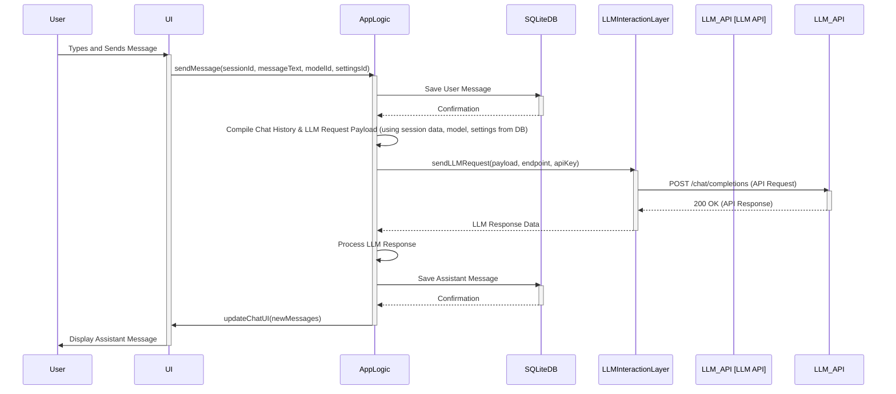
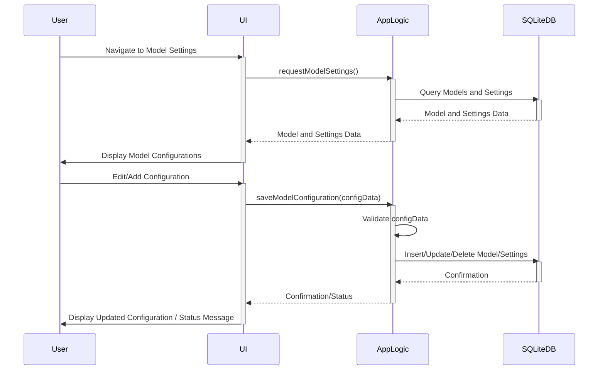
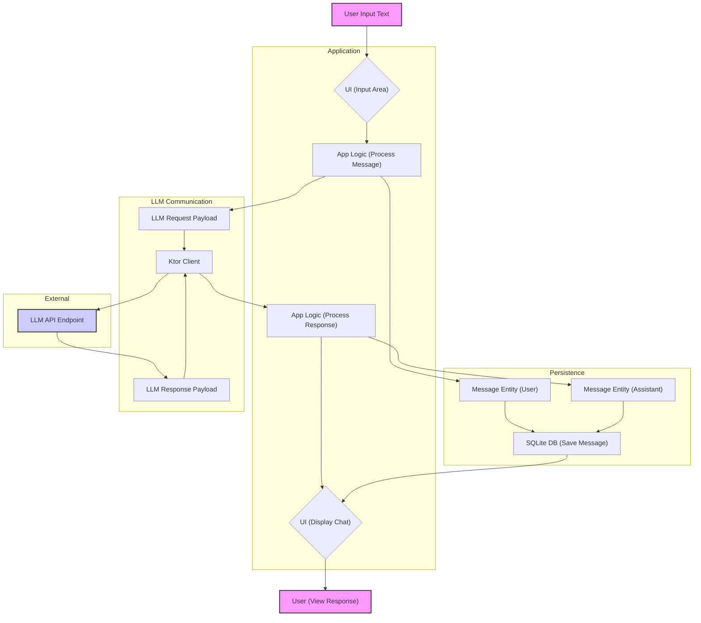
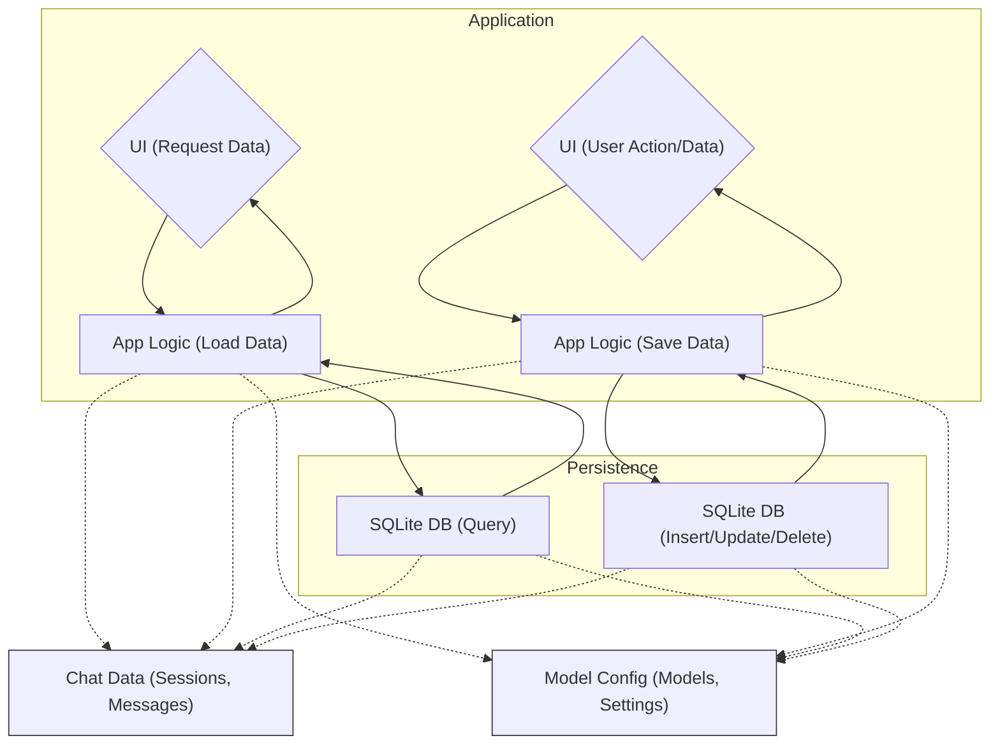
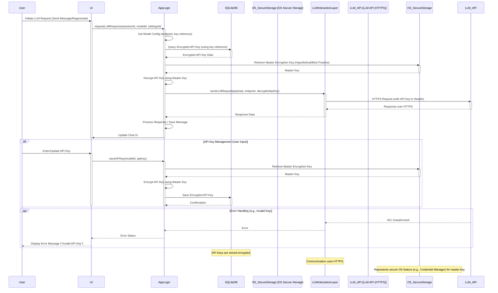

# System Flow Documentation: General-Purpose Chatbot Desktop App

**Version:** 1.0
**Date:** May 21, 2025

## 1. Document Header

*(Included above)*

## 2. System Overview

This document describes the architecture and key flows for a general-purpose chatbot application designed to run as a desktop application on Windows 11. The application allows users to interact with Large Language Models (LLMs) using their own OpenAI-compatible API keys, maintaining persistent chat session history and providing various features for managing conversations.

The system is composed of the following key components:

*   **User Interface (UI):** Built with Kotlin's Compose for Desktop. This is the visual layer the user interacts with. It displays chat sessions, messages, model settings, and controls.
*   **Application Logic (Backend/Core):** Written in Kotlin. This component handles user interactions received from the UI, orchestrates data persistence, manages LLM communication, and implements the core application features (editing messages, grouping sessions, etc.). It acts as the central hub connecting the UI, Database, and LLM Interaction Layer.
*   **LLM Interaction Layer:** Utilizes the Ktor client library. This component is responsible for making API calls to the configured LLM endpoints (e.g., OpenAI, OpenRouter, Google with OpenAI compatibility layer). It handles request formatting and response parsing according to the OpenAI API specification.
*   **Database:** A local SQLite database. This component stores persistent application data, including chat sessions, individual messages, configured models, API keys, and model settings.
*   **Configuration Management:** Handled within the Application Logic, storing and retrieving sensitive information (like API keys, endpoint URLs) and user-defined settings from the Database.

**Architecture Note:** The User Interface and Application Logic are integrated into a single process for the desktop application. The LLM Interaction Layer, built with Ktor, is designed such that it *could* be extracted into a separate service later, enabling a REST API architecture if needed, without requiring a complete rewrite of the core logic.

The primary data entities managed by the system are:

*   **Chat Sessions:** Representing a single conversation thread, potentially groupable.
*   **Messages:** Individual user prompts or assistant responses within a session.
*   **Models:** Definitions of LLM endpoints the user can use (URL, key reference, capabilities).
*   **Model Settings:** Specific configuration sets for a model (system message, temperature, etc.), allowing multiple presets per model.

## 3. User Workflows

This section outlines the primary journeys a user takes when interacting with the application.

### 3.1 Create and Manage Chat Sessions

1.  User opens the application.
2.  Application loads existing chat sessions from the database and displays them.
3.  User can start a "New Chat" session.
4.  The application creates a new, empty session, making it active.
5.  User can select an existing chat session to make it active.
6.  (Future) User can drag/drop or use controls to group sessions visually or logically.
7.  (Future) User can initiate session title/tag generation.
8.  (Future) User can initiate import/export of sessions.

### 3.2 Send a Message and Receive Response

This is the core interaction loop.

1.  User selects or creates a chat session.
2.  User types a message in the input area.
3.  User selects a model from the available options for the next response.
4.  (Optional) User selects specific model settings (e.g., 'Creative' preset).
5.  User clicks "Send" or presses Enter.
6.  The application adds the user's message to the active session's history (initially saving to DB).
7.  The application compiles the full conversation history (optionally applying selected model settings like system message) into the format required by the selected LLM API.
8.  The application sends the request via the LLM Interaction Layer to the chosen LLM endpoint, using the associated API key.
9.  The application waits for the LLM response.
10. Upon receiving the response, the application adds the assistant's message to the active session's history.
11. The new messages (user and assistant) are persisted in the database.
12. The UI is updated to display the assistant's response.
13. (Future) User can trigger "Generate another answer".

### 3.3 Edit/Remove Messages

1.  User interacts with a specific message in the UI (e.g., clicks an "Edit" button).
2.  The UI presents an interface to modify the message's text.
3.  User saves the changes.
4.  The UI sends the updated message text to the Application Logic.
5.  The Application Logic updates the corresponding message record in the database.
6.  The UI is updated to reflect the edited message.
7.  *Note:* Editing previous messages typically invalidates subsequent assistant responses in a logical sense, though the app will simply change the text and persist it. Re-generating subsequent responses based on an edit is a potential future feature.
8.  User interacts with a message to remove it.
9.  The UI sends a remove request to the Application Logic.
10. The Application Logic marks the message as removed (or deletes it) in the database.
11. The UI is updated to hide or remove the message.

### 3.4 Copy Messages/Session

1.  User interacts with a message or a session (e.g., right-clicks, clicks a "Copy" button).
2.  The UI requests the raw text content for the specific message or the entire session from the Application Logic.
3.  The Application Logic retrieves the text content (potentially formatting the session content, e.g., as Markdown).
4.  The Application Logic provides the text back to the UI.
5.  The UI places the raw text onto the system clipboard.

### 3.5 Manage Models and Settings

1.  User navigates to a "Settings" or "Models" management screen.
2.  The UI requests the list of configured models and their associated settings from the Application Logic.
3.  The Application Logic queries the database for model and settings data.
4.  The database returns the data.
5.  The UI displays the current configurations.
6.  User can add a new model (provide name, endpoint URL, API key).
7.  User can edit an existing model's details (e.g., change API key, URL).
8.  User can add, edit, or remove settings presets for a specific model (e.g., define a "Creative" setting with specific temperature/system message).
9.  For any modification, the UI sends the changes to the Application Logic.
10. The Application Logic validates the input and persists the changes to the database (insert/update/delete model/settings records).
11. The UI updates to show the saved configuration.
12. (Future) User can configure MCP servers here.

## 4. Data Flows

This section illustrates how data moves between the system components.

### 4.1 Send Message Data Flow

Describes the path of a user message from input to display and persistence.

### 4.2 Database Interaction Data Flow

Illustrates how the Application Logic interacts with the SQLite database for loading and saving persistent data.

## 5. Error Handling

Robust error handling is crucial for a smooth user experience, especially when dealing with external APIs and local persistence.

**Strategy:**

1.  **User Notification:** Errors that directly impact the user (e.g., LLM API failure, invalid API key) should be communicated clearly through the UI (e.g., status bar messages, pop-up dialogs). Avoid technical jargon in user-facing messages.
2.  **Internal Logging:** Detailed technical error information (stack traces, error codes from APIs) should be logged internally for debugging purposes. This could be to a file or standard error stream, depending on the desktop application deployment strategy.
3.  **Graceful Degradation:** Where possible, the application should remain functional even if one part fails. For example, database errors might prevent saving history but shouldn't crash the UI; LLM API errors should be reported, but the user should still be able to manage local sessions or settings.
4.  **Specific Error Handling:**
    *   **LLM API Errors:** Catch specific HTTP status codes and error payloads from the Ktor client.
        *   *Invalid API Key:* Prompt user to check settings.
        *   *Rate Limiting:* Inform user and suggest waiting or upgrading their plan.
        *   *Model Not Found/Unavailable:* Inform user to select a different model.
        *   *Internal LLM Error:* Report a generic error and suggest retrying or contacting the LLM provider.
        *   *Network Errors:* Indicate inability to reach the API and suggest checking internet connection or endpoint URL.
    *   **Database Errors:** Handle exceptions during SQLite operations (read, write, update, delete).
        *   Attempt retry for transient errors.
        *   Inform the user if persistence fails ("Could not save message history. Data may be lost.") and potentially suggest restarting the app or checking storage space.
        *   Ensure critical data like Model configurations are loaded correctly or prevent app usage if impossible.
    *   **User Input Errors:** Validate user input where necessary (e.g., non-empty messages).
    *   **Configuration Errors:** Check for missing or invalid configurations (e.g., empty API key when attempting to use a model). Guide the user to the settings screen.
    *   **(Future) MCP Server Errors:** Handle server startup failures, communication errors (stdio pipes), or errors within the MCP server's execution. Report these specifically in the UI related to tool use or RAG.

## 6. Security Flows

Security in a local desktop application with user-provided keys focuses primarily on local data protection and secure external communication.

**Key Aspects:**

1.  **API Key Management:**
    *   API keys are provided by the user and stored locally in the SQLite database.
    *   **Crucially:** API keys stored in the database should be **encrypted** using a robust encryption mechanism. Since this is a desktop app without a central server for key management, the encryption key would need to be derived from something available locally (e.g., a key stored securely by the OS, or derived from user interaction if a login/password were introduced, though not required currently). Simple obfuscation is insufficient.
    *   Keys should only be decrypted in memory just before being used for an API call via Ktor.
    *   Keys should never be logged or displayed in the UI after initial input (masking should be used).
2.  **Secure Communication:**
    *   The Ktor client *must* use HTTPS when connecting to LLM API endpoints.
    *   Implement proper SSL/TLS certificate validation to prevent Man-in-the-Middle attacks.
3.  **Local Data Protection:**
    *   The SQLite database file resides on the user's local machine.
    *   Protection of the database file relies heavily on the operating system's file system permissions and the user's overall system security practices.
    *   Consider encrypting sensitive parts of the database (beyond just API keys, potentially chat content if user desires high privacy), although this adds significant complexity. Encrypting API keys is a minimum requirement.
4.  **No Authentication/Authorization (Internal):** As a single-user desktop app, there's no concept of multiple users or permissions within the application itself. Access to the application's data is controlled solely by OS-level access to the file system.
5.  **Input/Output Sanitization:** While less critical for security and more for stability, sanitizing user input and processing LLM output helps prevent unexpected behavior or potential injection issues if future features process message content in complex ways (e.g., executing code from messages, though this is not in the scope).
6.  **(Future) MCP Security:**
    *   MCP servers executed via `stdio` (`command`/`args`) run as subprocesses. Ensure the command and arguments provided by the user are handled carefully to prevent arbitrary code execution vulnerabilities (though the prompt implies user provides config, adding MCP config via UI would need validation).
    *   Data exchanged over stdio pipes should be treated as potentially sensitive if the MCP server handles local files or other resources.

The primary security control flow involves retrieving and decrypting an API key from the database only when initiating an external LLM API request via Ktor, and ensuring that request uses HTTPS.

This concludes the initial system flow documentation.

