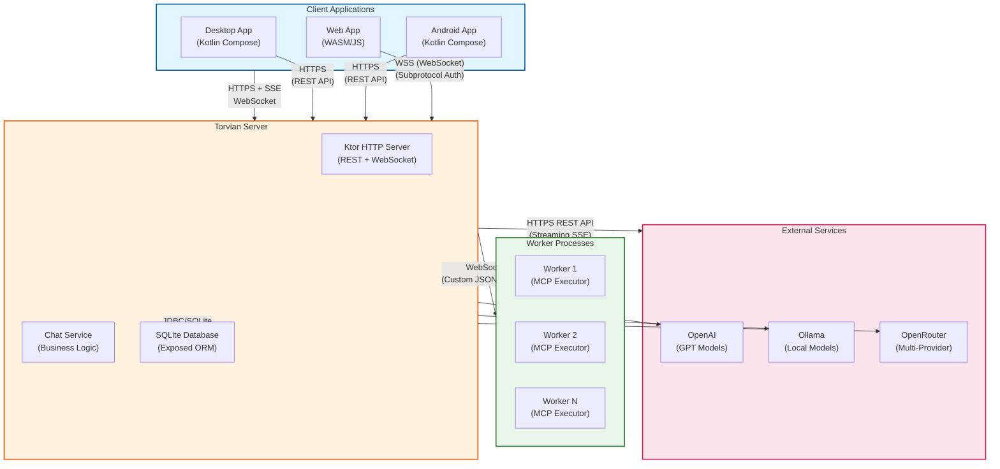
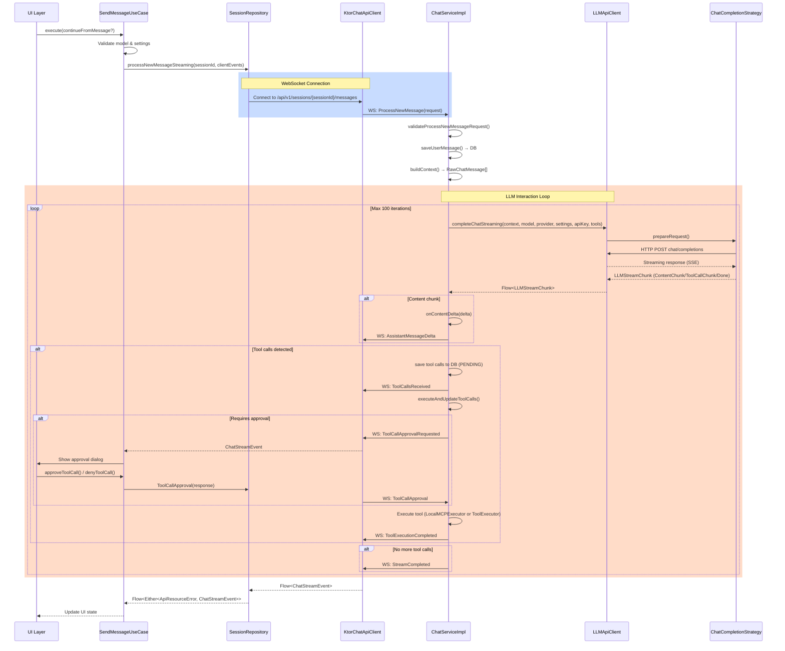
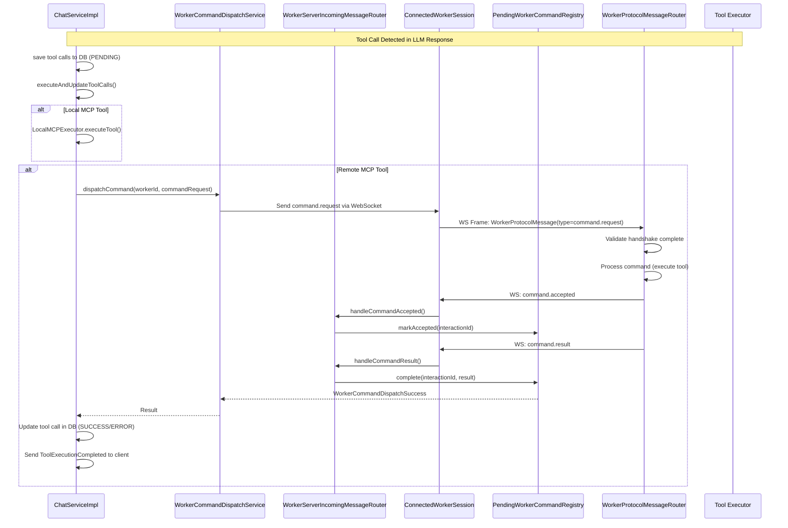
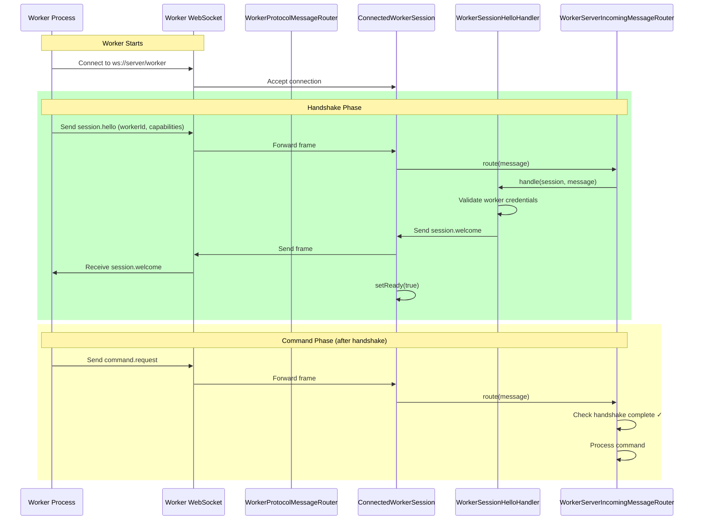
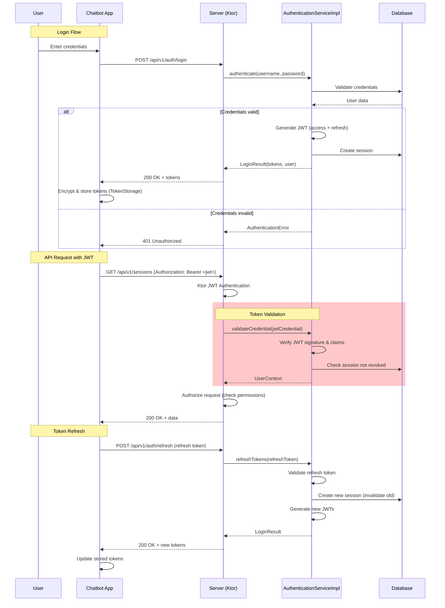
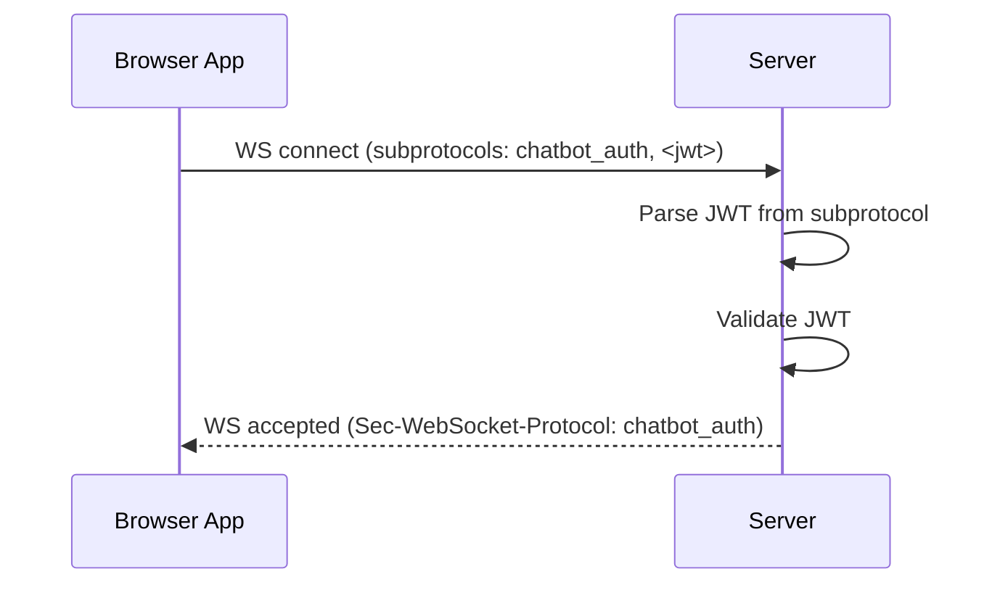

# Torvian Chatbot System Architecture Flows

This document provides onboarding documentation for new developers, documenting the key architectural flows in the Torvian chatbot system. Each flow includes a summary, key components, Mermaid sequence diagrams, and relevant DTOs.

---

## Table of Contents

1. [The LLM Chat Loop](#1-the-llm-chat-loop)
2. [Remote Tool Execution](#2-remote-tool-execution)
3. [Worker Registration](#3-worker-registration)
4. [Security Context](#4-security-context)
5. [Architectural Observations](#architectural-observations)

---

## Systems Overview

This section provides a high-level architectural view of the entire Torvian Chatbot deployment, showing how all components interact and communicate.

### Deployment Architecture Diagram



### Communication Protocols

| Connection | Protocol | Description |
|------------|----------|-------------|
| **Client → Server** | HTTPS + WebSocket | REST API for CRUD operations; WebSocket with SSE for streaming chat responses |
| **Server → Workers** | WebSocket (Custom) | Bidirectional JSON protocol using `WorkerProtocolMessage` envelope for command dispatch |
| **Server → LLM Providers** | HTTPS REST | HTTP POST to provider endpoints with streaming SSE response handling |
| **Server → Database** | JDBC/SQLite | Exposed ORM for SQLite database operations |

### Component Legend

| Symbol | Meaning |
|--------|---------|
| **HTTPS + SSE** | HTTP with Server-Sent Events for streaming |
| **WebSocket** | Bidirectional persistent connection |
| **WSS** | Secure WebSocket (TLS) |
| **JDBC** | Java Database Connectivity |

### Architecture Notes

- **Multi-Platform Clients**: The Compose Multiplatform app targets Desktop, Android, and Web (WASM) from a single codebase.
- **Stateless Server**: The Ktor server maintains no session state; JWT tokens carry user context.
- **Worker Pool**: Multiple Worker processes can connect to handle parallel tool executions.
- **Local & Cloud LLMs**: Ollama runs locally, while OpenAI/OpenRouter connect to cloud APIs.
- **Database**: SQLite provides lightweight persistence; could be swapped for PostgreSQL in production.

---

## 1. The LLM Chat Loop

### Summary

The LLM Chat Loop documents how a user sends a message from the App and receives a streaming response from the LLM. This is the primary user-facing flow, involving the App client, Server business logic, and external LLM providers (OpenAI, Ollama, etc.).

### Key Components

| Component | Module | Description |
|-----------|--------|-------------|
| `SendMessageUseCase` | app | Orchestrates message sending, handles both streaming and non-streaming modes |
| `SessionRepository` | app | Manages WebSocket connections and event flows |
| `KtorChatApiClient` | app | Ktor-based WebSocket client for server communication |
| `ChatServiceImpl` | server | Core business logic for message processing and LLM interaction |
| `LLMApiClient` | server | Interface for LLM API calls (abstracts provider details) |
| `LLMApiClientKtor` | server | Ktor implementation of LLM API client |
| `ChatCompletionStrategy` | server | Provider-specific strategies (OpenAI, Ollama) for LLM communication |
| `OpenAIChatStrategy` | server | OpenAI-specific chat completion implementation |
| `OllamaChatStrategy` | server | Ollama-specific chat completion implementation |

### Relevant DTOs (from `common/models`)

```kotlin
// Client → Server events
sealed interface ChatClientEvent {
    data class ProcessNewMessage(val request: ProcessNewMessageRequest)
    data class ToolCallApproval(val response: ToolCallApprovalResponse)
}

data class ProcessNewMessageRequest(
    val content: String?,
    val parentMessageId: Long?,
    val isStreaming: Boolean,
    val fileReferences: List<FileReference>
)

// Server → Client streaming events
sealed interface ChatStreamEvent {
    data class UserMessageSaved(...)
    data class AssistantMessageStart(...)
    data class AssistantMessageDelta(val messageId: Long, val deltaContent: String)
    data class ToolCallDelta(...)
    data class ToolCallsReceived(val toolCalls: List<ToolCall>)
    data class ToolCallApprovalRequested(val toolCall: ToolCall)
    data class ToolCallExecuting(val toolCall: ToolCall)
    data class ToolExecutionCompleted(val toolCall: ToolCall)
    data object StreamCompleted
    data class ErrorOccurred(val error: ApiError)
}
```

### Sequence Diagram



---

## 2. Remote Tool Execution

### Summary

When the LLM requests a tool call (MCP tool), the Server dispatches the execution to a remote Worker process via WebSocket. The Worker executes the tool and returns the result. This enables the system to run MCP servers as separate processes.

### Key Components

| Component | Module | Description |
|-----------|--------|-------------|
| `ChatServiceImpl` | server | Detects tool calls, initiates remote execution |
| `LocalMCPExecutor` | server | Executes local MCP tools; for remote, dispatches to Worker |
| `WorkerCommandDispatchService` | server | Dispatches commands to connected Workers |
| `WorkerServerIncomingMessageRouter` | server | Routes incoming Worker protocol messages |
| `ConnectedWorkerSession` | server | Represents a connected Worker WebSocket session |
| `PendingWorkerCommandRegistry` | server | Tracks pending command dispatches |
| `WorkerProtocolMessageRouter` | worker | Routes incoming protocol messages on Worker side |
| `InteractionRegistry` | worker | Tracks active interactions by ID |

### Relevant DTOs (from `common/models`)

```kotlin
// Generic worker protocol envelope
data class WorkerProtocolMessage(
    val id: String,
    val type: String,                    // e.g., "command.request"
    val replyTo: String? = null,
    val timestamp: Instant = Clock.System.now(),
    val protocolVersion: Int = 1,
    val interactionId: String,           // Correlation ID for the interaction
    val payload: JsonObject? = null
)

// Command request payload
data class WorkerCommandRequestPayload(
    val commandType: String,             // e.g., "mcp_tool_call", "mcp_server_control"
    val data: JsonObject                 // Command-specific data
)

// Command result payload
data class WorkerCommandResultPayload(
    val status: String,                  // "success", "error"
    val output: String? = null,
    val errorMessage: String? = null
)

// Protocol message types
object WorkerProtocolMessageTypes {
    const val SESSION_HELLO = "session.hello"
    const val SESSION_WELCOME = "session.welcome"
    const val COMMAND_REQUEST = "command.request"
    const val COMMAND_ACCEPTED = "command.accepted"
    const val COMMAND_RESULT = "command.result"
    const val COMMAND_REJECTED = "command.rejected"
    const val COMMAND_MESSAGE = "command.message"
    const val HEARTBEAT_PING = "heartbeat.ping"
    const val HEARTBEAT_PONG = "heartbeat.pong"
}
```

### Sequence Diagram



---

## 3. Worker Registration

### Summary

When a Worker process starts, it connects to the Server via WebSocket and performs a handshake (`session.hello` → `session.welcome`). This establishes the connection and authenticates the Worker.

### Key Components

| Component | Module | Description |
|-----------|--------|-------------|
| `ConnectedWorkerSession` | server | Represents the Worker's WebSocket session |
| `WorkerSessionHelloHandler` | server | Validates and processes worker hello |
| `WorkerServerIncomingMessageRouter` | server | Routes protocol messages after handshake |
| `SessionHandshakeContext` | worker | Tracks handshake state on Worker side |
| `WorkerProtocolMessageRouter` | worker | Routes messages, blocks commands until handshake |

### Sequence Diagram



---

## 4. Security Context

### Summary

Documents how authentication tokens (JWT) flow from the App to the Server, and how authorization is checked. The system uses JWT for stateless authentication with session-scoped token revocation.

### Key Components

| Component | Module | Description |
|-----------|--------|-------------|
| `JwtConfig` | server | JWT configuration (issuer, audience, secret, expiration) |
| `AuthenticationServiceImpl` | server | Handles login, token refresh, credential validation |
| `UserContext` | server | Authenticated user context extracted from JWT |
| `TokenStorage` | app | Securely stores tokens (encrypted on desktop, localStorage on web) |
| `BrowserWebSocketAuthSubprotocolProvider` | app | Browser-specific WebSocket auth (subprotocol fallback) |

### Relevant DTOs (from `common/models`)

```kotlin
// JWT Configuration
data class JwtConfig(
    val issuer: String = "chatbot-server",
    val audience: String = "chatbot-users",
    val realm: String = "chatbot-realm",
    val secret: String,
    val tokenExpirationMs: Long = 24 * 60 * 60 * 1000L,  // 24 hours
    val refreshExpirationMs: Long = 7 * 24 * 60 * 60 * 1000L  // 7 days
)

// Authenticated user context
data class UserContext(
    val user: User,
    val sessionId: Long,
    val tokenIssuedAt: Instant,
    val tokenExpiresAt: Instant
)

// App token storage (encrypted)
data class TokenStorageData(
    val accessToken: String,
    val refreshToken: String,
    val expiresAt: Instant,
    val user: User
)
```

### Sequence Diagram



### WebSocket Authentication (Browser vs Desktop)

The system handles WebSocket authentication differently for browser (WASM) and desktop targets:

- **Desktop**: Uses standard `Authorization` header
- **Browser**: Uses WebSocket subprotocol negotiation because browsers don't allow custom headers



---

## Architectural Observations

### Separation of Concerns

The codebase demonstrates clear separation between layers:

1. **Transport Layer**
   - `KtorChatApiClient` (App) - WebSocket communication
   - `ConnectedWorkerSession` (Server) - Worker WebSocket sessions
   - `WorkerProtocolMessageRouter` (Worker) - Protocol routing

2. **Business Logic Layer**
   - `ChatServiceImpl` (Server) - Core chat processing
   - `SendMessageUseCase` (App) - App-side orchestration
   - `WorkerCommandDispatchService` (Server) - Command dispatch

3. **External Integration Layer**
   - `LLMApiClient` + Strategies - LLM provider abstraction
   - `LocalMCPExecutor` / Remote execution - Tool execution

### Key Architectural Patterns

| Pattern | Usage |
|---------|-------|
| **Strategy Pattern** | `ChatCompletionStrategy` for provider-specific LLM calls |
| **Flow-based Streaming** | Kotlin Flows for SSE and WebSocket streaming |
| **Arrow Either** | Error handling with `Either<E, T>` throughout |
| **Protocol Buffers (JSON)** | `WorkerProtocolMessage` as generic envelope |
| **Interaction Registry** | Correlation of async command/result pairs |

### Module Boundaries

- **`common`**: Shared DTOs, protocols, and models (no dependencies on app/server)
- **`app`**: Client application (Compose Multiplatform)
- **`server`**: Backend service (Ktor, Exposed, SQLite)
- **`worker`**: MCP tool execution worker (standalone process)

### Transport vs Business Logic

The system clearly separates transport concerns from business logic:
- WebSocket frames are decoded into `WorkerProtocolMessage` at the transport layer
- Business logic operates on domain models (`ToolCall`, `ChatMessage`, etc.)
- The protocol layer (`WorkerProtocolMessage`) is intentionally minimal and transport-oriented

---

*Document generated for onboarding purposes. Last updated: 2026-04-30*
